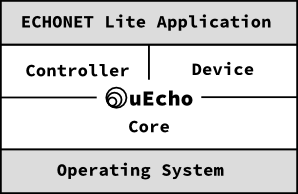

 

`uecho-go` is a portable and cross platform development framework for creating controller applications and devices of [ECHONET Lite][enet]. [ECHONET][enet] is an open standard specification for IoT devices in Japan, it specifies more than 100 IoT devices such as crime prevention sensor, air conditioner and refrigerator.

## What is uEcho ?

The `uecho-go` supports to control devices of [ECHONET Lite][enet] and create the standard devices of the specification easily. The `uecho-go` is designed in object-oriented programming, and the functions are object-oriented in their naming convention, and are grouped into classes such as `Controller`, `Node`, `Class` and `Object`.

To implement IoT controller or devices of [ECHONET Lite][enet], developer had to understand and implement the communication middleware specification such as the message format and base sequences.

The `uecho-go` is inspired by reactive programming too. Using The `uecho-go`, developer have only to set basic listeners to implement the devices and controllers because uEcho handles other requests such as request and notification requests automatically.

# Table of Contents

- Controller
  - [Overview of Controller](doc/controller_overview.md)
  - [Inside of Controller](doc/controller_inside.md)
- Device
  - [Overview of Device](doc/device_overview.md)
  - [Inside of Device](doc/device_inside.md)
- Appendix
  - [Expanded Configurations for Go Platform](doc/extension.md)
- [Examples](doc/examples.md)

[enet]:http://echonet.jp/english/
