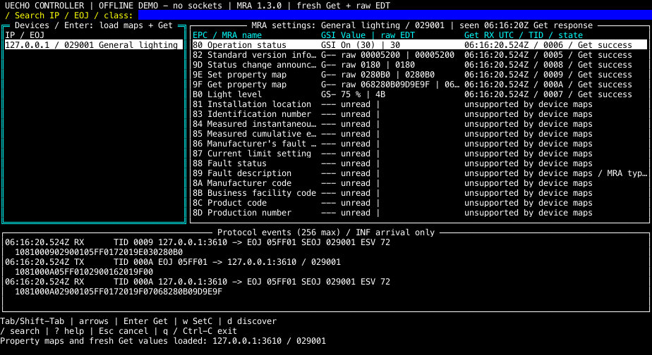

# uechotui

A fullscreen developer controller using uecho-go's public transport/protocol APIs and tview/tcell. The default is a **socket-free demo fixture**. Core and the existing examples do not depend on terminal packages: this example owns a separate Go module, with a relative replace pointing to this repository's core.

```sh
# From the uecho-go repository root; Go 1.25+
make tui
```

Press `d`, select **Confirm** to discover the offline fixture, select its EOJ and press Enter. Confirm loads 9D/9E/9F property maps, then sends a fresh Get for every readable EPC. Tab to Properties; Enter confirms a fresh Get. `w` opens an MRA enum, bounded number or size-constrained raw form only for a supported writable definition in validated Get and Set maps. Review shows the exact target, EPC and EDT; Cancel is selected first. Confirm sends one SetC, then a **separate Get with a new TID**. The result distinguishes sending, Get success, rejected, timeout/canceled, readback success, mismatch, and unknown. An acknowledged SetC alone is not success. Cancellation never rolls back a write and writes are never retried automatically.



[Enum form](docs/images/tui-set.png) · [Number form](docs/images/tui-number.png) · [Compact screen](docs/images/tui-compact.png). These are rasterized from actual tcell simulation-screen cells, not visual mockups. Demo TX/RX frames are in memory and are explicitly identified by the OFFLINE DEMO header; they are not socket captures.

| Key | Action |
| --- | --- |
| Tab / Shift-Tab | Devices → Properties → Protocol events; cyan focus border |
| Up / Down | Select a device/property or scroll log |
| Enter | Devices: confirm maps + Get; Properties: confirm fresh Get |
| `d` | Confirm multicast D6 discovery on selected interface (or optional unicast peer) |
| `w` | MRA typed form → Review → SetC confirmation → fresh Get |
| `/` | Search IP, EOJ or MRA class; Enter focuses devices |
| Esc | Cancel dialog; otherwise cancel in-flight request, clear search, focus devices |
| `?` | Key help |
| `q` / Ctrl-C | Exit, cancel workers and restore terminal; Ctrl-C also exits dialogs |

At less than 100 columns or 28 rows, devices and properties stack. Use at least 68×26; smaller screens can clip content but Esc/Ctrl-C remain usable. Selection/forms survive resize. Mouse input is disabled. Logs retain the latest 256 events and follow the tail when not focused; focus them to scroll.

## Explicit network use

Network mode is opt-in. `--network` opens an interface/address picker listing actual local multicast-capable IPv4 interfaces. Cancel is the initial focus. Confirm binds UDP 3610 and joins the group **on that selected interface**, receiving notifications; it sends no startup request or advertisement. Press `d` and confirm to send one multicast Get D6 to `224.0.23.0:3610`, destination EOJ `0EF000`. A three-second window collects correlated node-profile responses from multiple IPs and adds their instances to the left list. No peer IP is required. D5 instance-list INF and concrete device INF also update the list, with local last-seen time/source in the selected device header. At most 256 devices are retained; entries are observations, not an authoritative online/offline inventory.

```sh
make tui TUI_ARGS='--network'    # choose the intended interface/address in the UI
# Or specify both confirmed local values on the intended test network:
make tui TUI_ARGS='--network --interface INTERFACE --bind LOCAL_IPV4'
# Isolated unicast compatibility (no multicast membership):
make tui TUI_ARGS='--network --interface lo --bind 127.0.0.1 --peer 127.0.0.2'
```

The local IPv4 must belong to the named interface. IPv6, TCP, SetI/SetGet/INFC and periodic discovery are outside this example. Outbound multicast uses the selected IPv4 interface and TTL 1. Core public protocol/transport APIs encode and send messages and join multicast; the example configures the reusable unicast connection before binding, because the core Bind sets SO_REUSEADDR after bind. Core source is unchanged.

The right pane reconciles the pinned official **MRA 1.3.0** device/superclass names and schemas with actual 9D/9E/9F maps. Supported device properties are shown first with decoded current Get values **and raw EDT**; definition-only properties are marked unsupported and cannot be queried or edited. Unknown EPCs and unsupported schemas remain raw. MRA enum choices and bounded integer numbers provide typed inputs; fixed scale and unit come from the schema. Simple unions support special enum values alongside number input. Historical definitions use fresh EPC 82 release information; ambiguous or future versions disable editing. Every editor validates before Review and again before sending. See [MRA adapter provenance and supported types](internal/mra/README.md). This is developer tooling, not comprehensive MRA validation or certified appliance safety.

Maps are validated using the core public property-map decoder (list and bitmap formats), checked for count/duplicates and published together. Refresh disables old write permissions immediately. Readable properties are fetched sequentially, so settings are individual timestamped observations rather than an atomic device snapshot. Read-only, unknown, unsupported and unread values are distinguished. Typed editing also requires a Get-map entry for readback.

The log includes raw frame hex, TID, source/destination IP:port or EOJ, and local UTC send/receive time. Property rows show the **Get** RX timestamp/TID and state; the TX timestamp is in the log. Response matching requires TID, source IP and port 3610, both EOJs, expected success/error ESV and exact EPC/count. Strict datagram framing is validated before using the permissive library decoder. The example reads raw datagrams from the public transport socket's connection for this validation; encoding, socket binding and sending use uecho-go APIs. TIDs are not reused during a process lifetime; restart after 65535 requests. Duplicate responses do not block readers. Socket closure and canceled waits release workers.

INF includes no reliable remote timestamp. Its displayed time is **local arrival only**, and freshness is unknown. It never overwrites a fresh Get value or satisfies a request/readback. UDP can reorder or duplicate notifications; they remain diagnostic log entries. Unknown readback after a timeout/cancel means a Set may have applied; use a confirmed fresh Get to inspect it.

## Isolated simulator v1.0.0 verification

No household LAN or physical appliance was contacted. The integration test uses the public release [v1.0.0](https://github.com/cybergarage/uecho-simulator/releases/tag/v1.0.0), with controller `127.0.0.1:3610` and simulator `127.0.0.2:3610` on **Linux loopback**. Run inside a container with `--network none` or an isolated network namespace. Do not add host aliases: macOS normally cannot bind the second address.

```sh
# In the isolated Linux environment, with both repositories available:
cd uecho-simulator
GOWORK=off go build -o /tmp/uecho-simulator-v1 ./cmd/uecho-simulator
cd ../uecho-go/cmd/uechotui
UECHOTUI_SIMULATOR_V1=/tmp/uecho-simulator-v1 GOWORK=off \
  go test -race -v ./internal/controller -run TestSimulatorLoopback
```

The test starts/stops the released binary, discovers all three devices, loads all property maps and Get values, writes lighting EPC 80=30, verifies it with a distinct TID/fresh Get and receives status-change INF. The CI also creates `simtest0` with documentation-only addresses `192.0.2.10` (simulator) / `192.0.2.20` (controller), multicast enabled and a group route, all inside an isolated namespace. `UECHOTUI_ISOLATED_MULTICAST=1` opts into `TestSimulatorMulticast`, which refuses any other active/addressed interface. The released simulator runs with a private PTY, `--display 127.0.0.1:18990 --udp 192.0.2.10:3610 --allow-lan --multicast-interface simtest0`. It discovers three devices via multicast, loads maps/Get, writes lighting level B0=4B (75%), verifies fresh correlated Get and receives INF, then shuts down normally. See the exact namespace setup in [.github/workflows/uechotui.yml](../../.github/workflows/uechotui.yml); never execute that setup on a household interface. For interactive testing inside that same isolated environment, launch the simulator with `--plain --udp 127.0.0.2:3610`, then launch this controller with `--network --interface lo --bind 127.0.0.1 --peer 127.0.0.2` and perform confirmations yourself.

## Checks

```sh
GOWORK=off go -C cmd/uechotui mod download
make tui-check
```

Checks cover formatting, vet, tests/race and darwin/arm64 + linux/arm64 builds. Default example tests open no sockets. Fixtures cover identity/ESV/EPC/TID mismatches, duplicates, concurrent requests, timeout/cancel/close, exhausted TIDs, malformed frames, readback mismatch/unknown/rejection, stale INF isolation, keyboard navigation/search, confirmation cancellation, form apply, resize, and screen finalization. The opt-in released-simulator test is separate. Existing core/examples tests can open multicast sockets; run them only inside a disposable isolated namespace/container, not against household interfaces.

To regenerate actual widget screenshots:

```sh
cd cmd/uechotui
UECHOTUI_SCREENSHOT_DIR="$PWD/docs/images" GOWORK=off \
  go test ./internal/dashboard -run TestScreenshot -count=1
```

An optional `UECHOTUI_SCREENSHOT_FONT` path selects a local TTF/TTC for rasterization; committed images used macOS Menlo. The default embedded Go Mono font permits portable regeneration. No font file is distributed.

Navigation is informed by the official [uecho-simulator TUI](https://github.com/cybergarage/uecho-simulator/blob/v1.0.0/internal/tui/fullscreen.go) and its [README](https://github.com/cybergarage/uecho-simulator/blob/main/README.md). This example implements a reviewable developer workflow with a conservative subset of MRA types, not complete MRA validation or physical-device support. Physical appliances and household networks remain untested.
