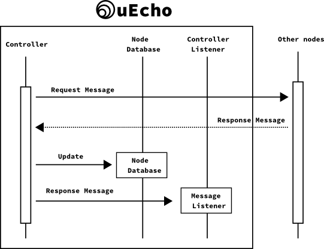

# Inside of uEcho Controller

## Node Profile Object

The controller is a special node specified in [ECHONET Lite][enet] to control other nodes. The controller must implement the following special node profile class object that contains all child objects of the node [\[1\]][enet-spec].

- Class group code: 0x0E
- Class code: 0xF0
- Instance code: 0x01 (general node)

The `uecho-go` automatically adds the node profile class objects when the controller is created, so developers don't need to add the objects themselves.

## Controller Message Listeners

The `uecho-go` handles all messages from other nodes automatically. However, developers can set listeners using `Controller::SetListener()` to listen to internal messages from other nodes. 

After a node receives a message from other nodes, the node's listeners are called in the following sequence:

## References

- \[1\] [Part II ECHONET Lite Communication Middleware Specification][enet-spec]

[enet]:http://echonet.jp/english/
[enet-spec]:http://www.echonet.gr.jp/english/spec/index.htm
