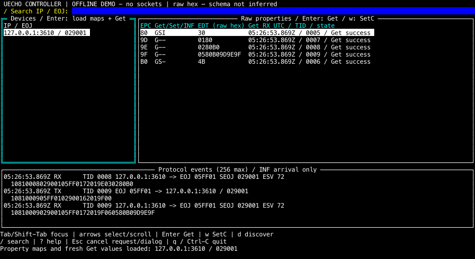

# uechotui

A fullscreen developer controller using uecho-go's public transport/protocol APIs and tview/tcell. The default is a **socket-free demo fixture**. Core and the existing examples do not depend on terminal packages: this example owns a separate Go module, with a relative replace pointing to this repository's core.

```sh
# From the uecho-go repository root; Go 1.25+
make tui
```

Press `d`, select **Confirm** to discover the offline fixture, select its EOJ and press Enter. Confirm loads 9D/9E/9F property maps, then sends a fresh Get for every readable EPC. Tab to Properties; Enter confirms a fresh Get. `w` opens a raw-hex form only for a property in the validated Set map. Review shows the exact target, EPC and EDT; Cancel is selected first. Confirm sends one SetC, then a **separate Get with a new TID**. The result distinguishes sending, Get success, rejected, timeout/canceled, readback success, mismatch, and unknown. An acknowledged SetC alone is not success. Cancellation never rolls back a write and writes are never retried automatically.



[Write form](docs/images/tui-set.png) · [Compact screen](docs/images/tui-compact.png). These are rasterized from actual tcell simulation-screen cells, not visual mockups. Demo TX/RX frames are in memory and are explicitly identified by the OFFLINE DEMO header; they are not socket captures.

| Key | Action |
| --- | --- |
| Tab / Shift-Tab | Devices → Properties → Protocol events; cyan focus border |
| Up / Down | Select a device/property or scroll log |
| Enter | Devices: confirm maps + Get; Properties: confirm fresh Get |
| `d` | Confirm node-profile D6 discovery to the explicit peer |
| `w` | Raw-hex write form → Review → SetC confirmation → fresh Get |
| `/` | Search IP or EOJ; Enter focuses devices |
| Esc | Cancel dialog; otherwise cancel in-flight request, clear search, focus devices |
| `?` | Key help |
| `q` / Ctrl-C | Exit, cancel workers and restore terminal; Ctrl-C also exits dialogs |

At less than 100 columns or 28 rows, devices and properties stack. Use at least 68×26; smaller screens can clip content but Esc/Ctrl-C remain usable. Selection/forms survive resize. Mouse input is disabled. Logs retain the latest 256 events and follow the tail when not focused; focus them to scroll.

## Explicit network use

Network mode requires all four options. Obtain the real local interface/IP and device IP yourself; this program does not infer them. No startup advertisement or discovery request is sent. Every request workflow starts through a UI confirmation.

```sh
# Replace the three placeholders with confirmed values on the intended test network.
make tui TUI_ARGS='--network --interface INTERFACE --bind LOCAL_IPV4 --peer DEVICE_IPV4'
```

The local IPv4 must belong to the specified interface. The controller listens on UDP **3610**, sends from that socket, and addresses the peer at 3610. `d` performs **unicast** Get D6 to node EOJ 0EF001 and uses the returned instance list as the device list. No multicast membership, LAN scan, advertisements, TCP, IPv6, SetI/SetGet/INFC, wildcard object requests or automatic multi-peer discovery is implemented in this first example. Multiple instances on the chosen peer are supported. Multicast discovery/notification reception is deferred. In simulator unicast mode, required INF arrives at the active controller IP:3610; those frames appear separately in the log.

All values are raw hexadecimal, including unknown EOJs/EPCs. No schema meanings, units or safe value ranges are guessed. Maps are validated using the core public property-map decoder (both list and bitmap formats), checked for count/duplicates, and published together. A map refresh first disables old write permissions. Readable properties are fetched sequentially, so values represent individual observations rather than an atomic device snapshot.

The log includes raw frame hex, TID, source/destination IP:port or EOJ, and local UTC send/receive time. Property rows show the **Get** RX timestamp/TID and state; the TX timestamp is in the log. Response matching requires TID, source IP and port 3610, both EOJs, expected success/error ESV and exact EPC/count. Strict datagram framing is validated before using the permissive library decoder. The example reads raw datagrams from the public transport socket's connection for this validation; encoding, socket binding and sending use uecho-go APIs. TIDs are not reused during a process lifetime; restart after 65535 requests. Duplicate responses do not block readers. Socket closure and canceled waits release workers.

INF includes no reliable remote timestamp. Its displayed time is **local arrival only**, and freshness is unknown. It never overwrites a fresh Get value or satisfies a request/readback. UDP can reorder or duplicate notifications; they remain diagnostic log entries. Unknown readback after a timeout/cancel means a Set may have applied; use a confirmed fresh Get to inspect it.

## Isolated simulator v1.0.0 verification

No household LAN or physical appliance was contacted. The integration test uses the public release [v1.0.0](https://github.com/cybergarage/uecho-simulator/releases/tag/v1.0.0), with controller `127.0.0.1:3610` and simulator `127.0.0.2:3610` on **Linux loopback**. Run inside a container with `--network none` or an isolated network namespace. Do not add host aliases: macOS normally cannot bind the second address.

```sh
# In the isolated Linux environment, with both repositories available:
cd uecho-simulator
GOWORK=off go build -o /tmp/uecho-simulator-v1 ./cmd/uecho-simulator
cd ../uecho-go/examples/uechotui
UECHOTUI_SIMULATOR_V1=/tmp/uecho-simulator-v1 GOWORK=off \
  go test -race -v ./internal/controller -run TestSimulatorLoopback
```

The test starts/stops the released binary, discovers all three devices, loads all property maps and Get values, writes lighting EPC 80=30, verifies it with a distinct TID/fresh Get and receives status-change INF. The same procedure is a dedicated CI job in an isolated Linux namespace. For interactive testing inside that same isolated environment, launch the simulator with `--plain --udp 127.0.0.2:3610`, then launch this controller with `--network --interface lo --bind 127.0.0.1 --peer 127.0.0.2` and perform confirmations yourself.

## Checks

```sh
GOWORK=off go -C examples/uechotui mod download
make tui-check
```

Checks cover formatting, vet, tests/race and darwin/arm64 + linux/arm64 builds. Default example tests open no sockets. Fixtures cover identity/ESV/EPC/TID mismatches, duplicates, concurrent requests, timeout/cancel/close, exhausted TIDs, malformed frames, readback mismatch/unknown/rejection, stale INF isolation, keyboard navigation/search, confirmation cancellation, form apply, resize, and screen finalization. The opt-in released-simulator test is separate. Existing core/examples tests can open multicast sockets; run them only inside a disposable isolated namespace/container, not against household interfaces.

To regenerate actual widget screenshots:

```sh
cd examples/uechotui
UECHOTUI_SCREENSHOT_DIR="$PWD/docs/images" GOWORK=off \
  go test ./internal/dashboard -run TestScreenshot -count=1
```

An optional `UECHOTUI_SCREENSHOT_FONT` path selects a local TTF/TTC for rasterization; committed images used macOS Menlo. The default embedded Go Mono font permits portable regeneration. No font file is distributed.

Navigation is informed by the official [uecho-simulator TUI](https://github.com/cybergarage/uecho-simulator/blob/v1.0.0/internal/tui/fullscreen.go) and its [README](https://github.com/cybergarage/uecho-simulator/blob/main/README.md). This example implements a first reviewable raw developer workflow, not complete MRA validation or physical-device support. Physical appliances and household networks remain untested.
